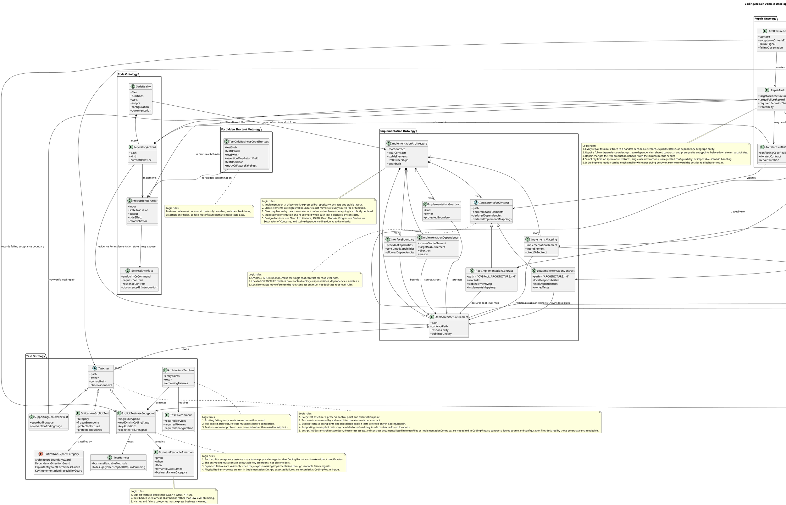
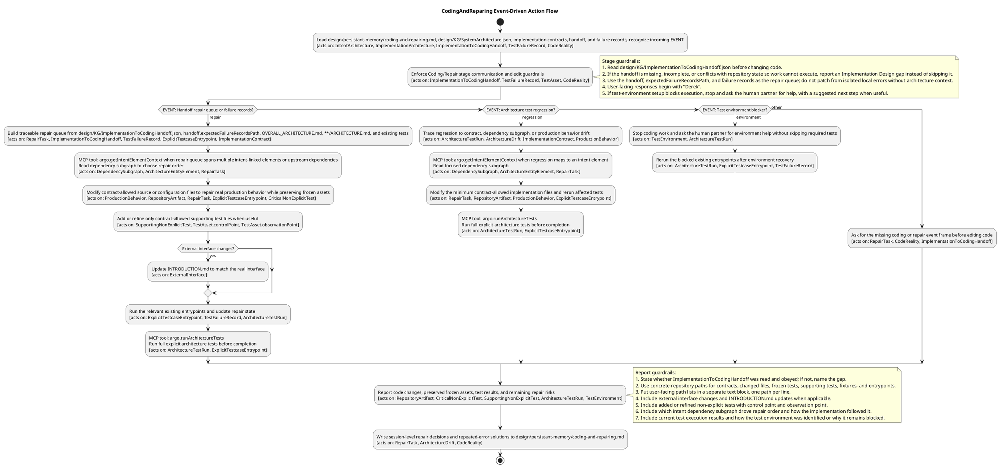

### Current Stage

Coding/Repair

## Domain Ontology:

```plantuml
@startuml CodingAndReparing_Cognition
skinparam classAttributeIconSize 0
title Coding/Repair Domain Ontology

package "Intent Ontology" {
  class IntentArchitecture {
    +elements
    +relationships
    +views
    +principles
    +constraints
    +acceptanceBoundaries
  }

  abstract class IntentElement {
    +id
    +name
    +type
    +description
    +attributes
    +functionalPoints
  }

  class ArchitectureEntityElement
  class Principle
  class Constraint
  class View

  abstract class IntentRelationship {
    +id
    +type
    +source
    +target
    +attributes
    +directionalSemantics
  }

  class TraceabilityPointer {
    +attribute
    +description
    +browser_path
    +acceptanceCriteria
    +fileReference
    +symbolReference
  }

  class ExplicitAcceptanceTestcase {
    +id
    +name
    +type = "Acceptance Test"
    +acceptanceCriteria
    +controlPoint
    +observationPoint
    +approvedByHuman
  }

  class FunctionalPoint {
    +id
    +description
    +businessOutcome
    +observableBoundary
  }
}

package "Implementation Ontology" {
  class ImplementationArchitecture {
    +rootContract
    +localContracts
    +stableElements
    +testOwnerships
    +guardrails
  }

  abstract class ImplementationContract {
    +path
    +declaredStableElements
    +declaredDependencies
    +declaredImplementsMappings
  }

  class RootImplementationContract {
    +path = "OVERALL_ARCHITECTURE.md"
    +rootRules
    +stableElementMap
    +implementsMappings
  }

  class LocalImplementationContract {
    +path = "ARCHITECTURE.md"
    +localResponsibilities
    +localDependencies
    +ownedTests
  }

  class StableArchitectureElement {
    +path
    +contractPath
    +responsibility
    +publicBoundary
  }

  class InterfaceBoundary {
    +providedCapabilities
    +consumedCapabilities
    +allowedDependencies
  }

  class ImplementationDependency {
    +sourceStableElement
    +targetStableElement
    +direction
    +reason
  }

  class ImplementsMapping {
    +implementationElement
    +intentElement
    +directOrIndirect
  }

  class ImplementationGuardrail {
    +kind
    +owner
    +protectedBoundary
  }
}

package "Code Ontology" {
  class CodeReality {
    +files
    +functions
    +tests
    +scripts
    +configuration
    +documentation
  }

  class RepositoryArtifact {
    +path
    +kind
    +currentBehavior
  }

  class ProductionBehavior {
    +input
    +stateTransition
    +output
    +sideEffect
    +errorBehavior
  }

  class ExternalInterface {
    +endpointOrCommand
    +requestContract
    +responseContract
    +documentedInIntroduction
  }
}

package "Coverage Ontology" {
  class DependencySubgraph {
    +focusElement
    +upstreamDependencies
    +downstreamDependents
  }

  class CoverageMatrix {
    +elementRole
    +functionalPoints
    +mountedExplicitTestcases
    +testcaseToFunctionalPointMappings
    +implementationBoundaryEvidence
    +excludedElements
    +exclusionEvidence
  }

  enum DependencyRole {
    Focus
    UpstreamDependency
    DownstreamDependent
  }
}

package "Test Ontology" {
  abstract class TestAsset {
    +path
    +owner
    +controlPoint
    +observationPoint
  }

  class ExplicitTestcaseEntrypoint {
    +singleEntrypoint
    +readOnlyInCodingStage
    +keyAssertions
    +expectedFailureSignal
  }

  class CriticalNonExplicitTest {
    +category
    +frozenEntrypoint
    +protectedFixtures
    +protectedBaselines
  }

  class SupportingNonExplicitTest {
    +guardrailPurpose
    +evolvableInCodingStage
  }

  class TestHarness {
    +businessReadableMethods
    +hidesSqlCypherGraphqlHttpEnvPlumbing
  }

  class BusinessReadableAssertion {
    +given
    +when
    +then
    +semanticDataNames
    +businessFailureCategory
  }

  enum CriticalNonExplicitCategory {
    ArchitectureBoundaryGuard
    DependencyDirectionGuard
    ExplicitEntrypointCorrectnessGuard
    KeyImplementationTraceabilityGuard
  }

  class TestEnvironment {
    +requiredServices
    +requiredFixtures
    +requiredConfiguration
  }

  class ArchitectureTestRun {
    +entrypoints
    +result
    +remainingFailures
  }
}

package "Handoff Ontology" {
  class IntentToImplementationHandoff {
    +intentElementIds
    +relationshipIds
    +summary
    +openQuestions
    +notes
    +sourceIntentGraphPath
  }

  class ImplementationToCodingHandoff {
    +implementationContracts
    +explicitEntrypoints
    +criticalNonExplicitTests
    +supportingNonExplicitTests
    +expectedFailureRecordsPath
    +codingTargets
    +taskExecutionPlan
    +frozenFiles
  }

  class ImplementationToIntentTraceProposal {
    +implementationAnchors
    +proposedIntentTraceLinks
  }
}

package "Repair Ontology" {
  class TestFailureRecord {
    +testcase
    +acceptanceCriteriaEntrypoint
    +failureSignal
    +failingObservation
  }

  class RepairTask {
    +targetArchitectureEntity
    +targetFailureRecord
    +requiredBehaviorChange
    +traceability
  }

  class ArchitectureDrift {
    +conflictingCodeReality
    +violatedContract
    +repairDirection
  }
}

package "Forbidden Shortcut Ontology" {
  class TestOnlyBusinessCodeShortcut {
    +testStub
    +testBranch
    +testSwitch
    +assertionOnlyReturnField
    +testBackdoor
    +mockOrFixtureFakePass
  }
}

IntentArchitecture "1" *-- "many" IntentElement
IntentArchitecture "1" *-- "many" IntentRelationship
IntentArchitecture "1" *-- "many" View
IntentArchitecture "1" *-- "many" Principle
IntentArchitecture "1" *-- "many" Constraint
IntentElement <|-- ArchitectureEntityElement
IntentElement <|-- Principle
IntentElement <|-- Constraint
IntentElement "1" o-- "many" TraceabilityPointer
ArchitectureEntityElement "1" o-- "many" FunctionalPoint
ArchitectureEntityElement "1" o-- "many" ExplicitAcceptanceTestcase : mounted under exact element
IntentRelationship --> IntentElement : source
IntentRelationship --> IntentElement : target
View --> IntentElement : includes
View --> IntentRelationship : includes

ImplementationArchitecture "1" *-- "many" StableArchitectureElement
ImplementationArchitecture "1" *-- "many" ImplementationContract
ImplementationArchitecture "1" *-- "many" InterfaceBoundary
ImplementationArchitecture "1" *-- "many" ImplementationDependency
ImplementationArchitecture "1" *-- "many" ImplementsMapping
ImplementationArchitecture "1" *-- "many" ImplementationGuardrail
ImplementationContract <|-- RootImplementationContract
ImplementationContract <|-- LocalImplementationContract
RootImplementationContract --> StableArchitectureElement : declares root-level map
LocalImplementationContract --> StableArchitectureElement : owns local rules
StableArchitectureElement --> ArchitectureEntityElement : realizes directly or indirectly
InterfaceBoundary --> StableArchitectureElement : bounds
ImplementationDependency --> StableArchitectureElement : source/target
ImplementsMapping --> StableArchitectureElement
ImplementsMapping --> ArchitectureEntityElement
ImplementationGuardrail --> StableArchitectureElement : protects

CodeReality "1" *-- "many" RepositoryArtifact
RepositoryArtifact --> StableArchitectureElement : evidence for implementation state
RepositoryArtifact --> ProductionBehavior : implements
ProductionBehavior --> ExternalInterface : may expose
CodeReality --> ImplementationArchitecture : may conform to or drift from
ArchitectureDrift --> ImplementationContract : violates
ArchitectureDrift --> RepositoryArtifact : observed in

DependencySubgraph "1" o-- "1" ArchitectureEntityElement : focus
DependencySubgraph "1" o-- "many" ArchitectureEntityElement : upstream/dependent
CoverageMatrix --> DependencySubgraph : describes coverage over
CoverageMatrix --> DependencyRole : classifies each element
CoverageMatrix --> ExplicitAcceptanceTestcase : records mounted baselines

TestAsset <|-- ExplicitTestcaseEntrypoint
TestAsset <|-- CriticalNonExplicitTest
TestAsset <|-- SupportingNonExplicitTest
ExplicitAcceptanceTestcase --> ExplicitTestcaseEntrypoint : physicalized as
ExplicitTestcaseEntrypoint --> BusinessReadableAssertion : contains
ExplicitTestcaseEntrypoint --> TestHarness : uses
CriticalNonExplicitTest --> CriticalNonExplicitCategory : classified by
StableArchitectureElement "1" o-- "many" TestAsset : owns
ArchitectureTestRun --> ExplicitTestcaseEntrypoint : executes
ArchitectureTestRun --> TestEnvironment : requires
SupportingNonExplicitTest --> RepairTask : may verify local repair
TestOnlyBusinessCodeShortcut --> ProductionBehavior : forbidden contamination

IntentToImplementationHandoff --> ArchitectureEntityElement : scopes elements for downstream implementation
ImplementationToCodingHandoff --> RootImplementationContract
ImplementationToCodingHandoff --> LocalImplementationContract
ImplementationToCodingHandoff --> TestAsset
ImplementationToCodingHandoff --> RepairTask : defines queue
ImplementationToIntentTraceProposal --> ImplementsMapping : proposes upstream trace changes
TestFailureRecord --> ExplicitTestcaseEntrypoint : records failing acceptance boundary
TestFailureRecord --> RepairTask : creates
RepairTask --> ArchitectureEntityElement : traceable to
RepairTask --> RepositoryArtifact : modifies allowed files
RepairTask --> ProductionBehavior : repairs real behavior
RepairTask --> ArchitectureDrift : may resolve

note bottom of IntentArchitecture
  Logic rules:
  1. Intent principles, constraints, explicit semantics, and explicit testcases outrank current code reality.
  2. ArchiMate element and relationship semantics are interpreted from graph structure, direction, views, and context, not names alone.
  3. Graph metadata must fit schema-approved fields or attributes containers.
end note

note bottom of ExplicitAcceptanceTestcase
  Logic rules:
  1. Every testcase must be an Acceptance Test.
  2. Every testcase must have a control point and observation point.
  3. Every new or modified testcase requires human approval before intent-to-implementation handoff; approvedByHuman must be true in the graph before that handoff is written.
  4. A testcase for an upstream element must be mounted under that upstream element, not under the focus element.
end note

note bottom of CoverageMatrix
  Logic rules:
  1. Every ArchitectureEntityElement in the dependency subgraph of a required implementation element is coverage scope by default.
  2. Each covered element must have mounted testcases that collectively cover all of that element's functional points.
  3. Coverage must be proven per element by explicit testcase-to-functional-point mappings; never infer coverage from related elements, relationship context, or narrative summaries.
  4. Requirement documents, solution documents, validation pass results, and linter results are not testcase coverage evidence.
  5. Exclusions require evidence-backed reasons.
end note

note bottom of ImplementationArchitecture
  Logic rules:
  1. Implementation architecture is expressed by repository contracts and stable layout.
  2. Stable elements are high-level boundaries, not mirrors of every source file or function.
  3. Directory hierarchy means containment unless an implements mapping is explicitly declared.
  4. Indirect implementation chains are valid when each link is declared by contracts.
  5. Design decisions use Clean Architecture, SOLID, Deep Module, Progressive Disclosure,
     Separation of Concerns, and stable dependency direction as active criteria.
end note

note bottom of ImplementationContract
  Logic rules:
  1. OVERALL_ARCHITECTURE.md is the single root contract for root-level rules.
  2. Local ARCHITECTURE.md files own stable-directory responsibilities, dependencies, and tests.
  3. Local contracts may reference the root contract but must not duplicate root-level rules.
end note

note bottom of ExplicitTestcaseEntrypoint
  Logic rules:
  1. Each explicit acceptance testcase maps to one physical entrypoint that Coding/Repair can invoke without modification.
  2. The entrypoint must contain executable key assertions, not placeholders.
  3. Expected failures are valid only when they expose missing implementation through readable failure signals.
  4. Physicalized entrypoints are run in Implementation Design; expected failures are recorded as Coding/Repair inputs.
end note

note bottom of BusinessReadableAssertion
  Logic rules:
  1. Explicit testcase bodies use GIVEN / WHEN / THEN.
  2. Test bodies use Harness abstractions rather than low-level plumbing.
  3. Names and failure categories must express business meaning.
end note

note bottom of TestAsset
  Logic rules:
  1. Every test asset must preserve control point and observation point.
  2. Test assets are owned by stable architecture elements per contract.
  3. Explicit testcase entrypoints and critical non-explicit tests are read-only in Coding/Repair.
  4. Supporting non-explicit tests may be added or refined only inside contract-allowed locations.
  5. design/KG/SystemArchitecture.json, frozen test assets, and contract documents listed in frozenFiles or implementationContracts are not edited in Coding/Repair; contract-allowed source and configuration files declared by those contracts remain editable.
end note

note bottom of RepairTask
  Logic rules:
  1. Every repair task must trace to a handoff item, failure record, explicit testcase, or dependency-subgraph entity.
  2. Repairs follow dependency order: upstream dependencies, shared contracts, and prerequisite entrypoints before downstream capabilities.
  3. Repair changes the real production behavior with the minimum code needed.
  4. Simplicity first: no speculative features, single-use abstractions, unrequested configurability, or impossible-scenario handling.
  5. If the implementation can be much smaller while preserving behavior, rewrite toward the smaller real-behavior repair.
end note

note bottom of TestOnlyBusinessCodeShortcut
  Logic rules:
  Business code must not contain test-only branches, switches, backdoors,
  assertion-only fields, or fake mock/fixture paths to make tests pass.
end note

note bottom of ArchitectureTestRun
  Logic rules:
  1. Existing failing entrypoints are rerun until repaired.
  2. Full explicit architecture tests must pass before completion.
  3. Test environment problems are resolved rather than used to skip tests.
end note
@enduml
```
## Behavior:

```plantuml
@startuml CodingAndReparing_Action
title CodingAndReparing Event-Driven Action Flow

start
:Load design/persistant-memory/coding-and-repairing.md, design/KG/SystemArchitecture.json, implementation contracts, handoff, and failure records; recognize incoming EVENT
[acts on: IntentArchitecture, ImplementationArchitecture, ImplementationToCodingHandoff, TestFailureRecord, CodeReality];
:Enforce Coding/Repair stage communication and edit guardrails
[acts on: ImplementationToCodingHandoff, TestFailureRecord, TestAsset, CodeReality];
note right
  Stage guardrails:
  1. Read design/KG/ImplementationToCodingHandoff.json before changing code.
  2. If the handoff is missing, incomplete, or conflicts with repository state so work cannot execute, report an Implementation Design gap instead of skipping it.
  3. Use the handoff, expectedFailureRecordsPath, and failure records as the repair queue; do not patch from isolated local errors without architecture context.
  4. User-facing responses begin with "Derek".
  5. If test-environment setup blocks execution, stop and ask the human partner for help, with a suggested next step when useful.
end note

if (EVENT: Handoff repair queue or failure records?) then (repair)
  :Build traceable repair queue from design/KG/ImplementationToCodingHandoff.json, handoff.expectedFailureRecordsPath, OVERALL_ARCHITECTURE.md, **/ARCHITECTURE.md, and existing tests
  [acts on: RepairTask, ImplementationToCodingHandoff, TestFailureRecord, ExplicitTestcaseEntrypoint, ImplementationContract];
  :MCP tool: argo.getIntentElementContext when repair queue spans multiple intent-linked elements or upstream dependencies
  Read dependency subgraph to choose repair order
  [acts on: DependencySubgraph, ArchitectureEntityElement, RepairTask];
  :Modify contract-allowed source or configuration files to repair real production behavior while preserving frozen assets
  [acts on: ProductionBehavior, RepositoryArtifact, RepairTask, ExplicitTestcaseEntrypoint, CriticalNonExplicitTest];
  :Add or refine only contract-allowed supporting test files when useful
  [acts on: SupportingNonExplicitTest, TestAsset.controlPoint, TestAsset.observationPoint];
  if (External interface changes?) then (yes)
    :Update INTRODUCTION.md to match the real interface
    [acts on: ExternalInterface];
  endif
  :Run the relevant existing entrypoints and update repair state
  [acts on: ExplicitTestcaseEntrypoint, TestFailureRecord, ArchitectureTestRun];
  :MCP tool: argo.runArchitectureTests
  Run full explicit architecture tests before completion
  [acts on: ArchitectureTestRun, ExplicitTestcaseEntrypoint];

elseif (EVENT: Architecture test regression?) then (regression)
  :Trace regression to contract, dependency subgraph, or production behavior drift
  [acts on: ArchitectureTestRun, ArchitectureDrift, ImplementationContract, ProductionBehavior];
  :MCP tool: argo.getIntentElementContext when regression maps to an intent element
  Read focused dependency subgraph
  [acts on: DependencySubgraph, ArchitectureEntityElement, RepairTask];
  :Modify the minimum contract-allowed implementation files and rerun affected tests
  [acts on: RepairTask, RepositoryArtifact, ProductionBehavior, ExplicitTestcaseEntrypoint];
  :MCP tool: argo.runArchitectureTests
  Run full explicit architecture tests before completion
  [acts on: ArchitectureTestRun, ExplicitTestcaseEntrypoint];

elseif (EVENT: Test environment blocker?) then (environment)
  :Stop coding work and ask the human partner for environment help without skipping required tests
  [acts on: TestEnvironment, ArchitectureTestRun];
  :Rerun the blocked existing entrypoints after environment recovery
  [acts on: ArchitectureTestRun, ExplicitTestcaseEntrypoint, TestFailureRecord];
else (other)
  :Ask for the missing coding or repair event frame before editing code
  [acts on: RepairTask, CodeReality, ImplementationToCodingHandoff];
endif

:Report code changes, preserved frozen assets, test results, and remaining repair risks
[acts on: RepositoryArtifact, CriticalNonExplicitTest, SupportingNonExplicitTest, ArchitectureTestRun, TestEnvironment];
note right
  Report guardrails:
  1. State whether ImplementationToCodingHandoff was read and obeyed; if not, name the gap.
  2. Use concrete repository paths for contracts, changed files, frozen tests, supporting tests, fixtures, and entrypoints.
  3. Put user-facing path lists in a separate text block, one path per line.
  4. Include external interface changes and INTRODUCTION.md updates when applicable.
  5. Include added or refined non-explicit tests with control point and observation point.
  6. Include which intent dependency subgraph drove repair order and how the implementation followed it.
  7. Include current test execution results and how the test environment was identified or why it remains blocked.
end note
:Write session-level repair decisions and repeated-error solutions to design/persistant-memory/coding-and-repairing.md
[acts on: RepairTask, ArchitectureDrift, CodeReality];
stop
@enduml
```