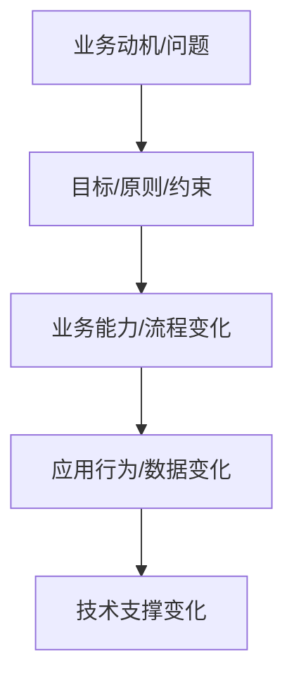
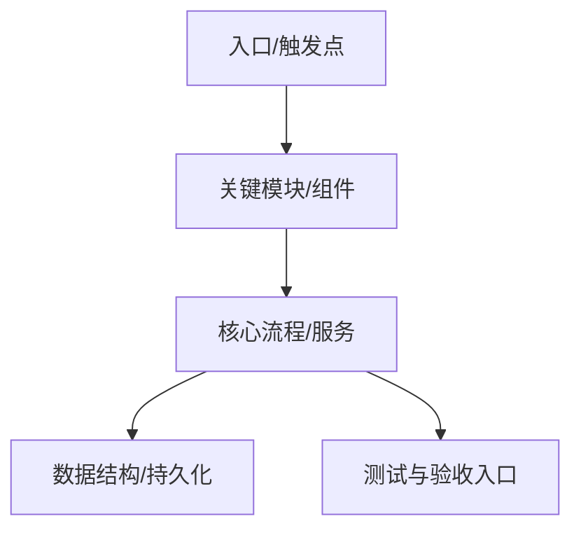

# Delivery Archive

在一次 orchestrator 交付迭代结束后，将本次迭代的需求、实现架构设计、开发交付与测试验收沉淀为稳定文档。归档目标不是重新设计或补做交付，而是把已经发生并有证据的内容整理到 `docs/[日期]-[需求或解决的问题名称]/`。

## Trigger

Use this skill when:

- orchestrating 流程已到 `Delivery accepted`、准备结束、需要归档；

## Archive Location

1. 使用本地日期 `YYYY-MM-DD`。
2. 从本次需求、缺陷或解决的问题中提取一个短名称，使用中文或英文均可；移除路径非法字符，空格可替换为 `-`。
3. 创建目录：`docs/YYYY-MM-DD-[需求或解决的问题名称]/`。
4. 在目录下创建且只创建这 4 个核心文档：
   - `PRD.md`
   - `架构设计.md`
   - `代码交付自测试.md`
   - `规格验收.md`

If the exact requirement name is ambiguous, ask the user for the archive directory name before writing files.

## Evidence Sources

Prefer evidence in this order:

1. User-stated requirement, PRD notes, issue description, or problem statement.
2. `design/KG/IntentToImplementationHandoff.json` and IntentionDesign outputs.
3. `design/KG/ImplementationToCodingHandoff.json` and ImplementationDesign outputs.
4. Git diff, relevant commits, changed files, and CodingAndReparing delivery notes.
5. Test commands, `argo.runArchitectureTests`, lints, manual verification, and acceptance audit outputs.

Do not invent missing facts. If evidence is absent, write `未提供/未找到证据` and list what would be needed to complete that section.

## Workflow

1. Identify iteration scope: requirement/problem name, accepted behavior, changed modules, and involved agents.
2. Inspect relavant envidence, do not modify any file ,and do not execute any test.
3. Create the archive directory under `docs/`.
4. Write the four markdown files using the templates below.
5. Verify all four files exist and each file has concrete evidence or explicit gaps.
6. Return a concise summary with archive path, evidence used, and any missing evidence.

## Document Templates

### PRD.md

# PRD

## 背景与问题
[本次迭代要解决的业务问题、用户痛点、缺陷背景或触发原因]

## 目标
- [目标 1]
- [目标 2]

## 范围
### In Scope
- [本次明确交付内容]

### Out of Scope
- [明确不包含内容；没有证据则写“未提供/未找到证据”]

## 用户/业务价值
[交付后带来的业务、流程、效率或质量价值]

## 需求场景&规格

### 业务场景 1：[场景名称]
- 场景说明：[用户/角色在什么上下文中要完成什么业务目标]
- 业务规格：[功能、行为、数据、流程、约束等规格]
- 验收标准：[可验证验收标准]
- 显性测试用例：[涉及的显性测试用例及其覆盖的业务场景规格]

### 业务场景 2：[场景名称]
- 场景说明：[用户/角色在什么上下文中要完成什么业务目标]
- 业务规格：[功能、行为、数据、流程、约束等规格]
- 验收标准：[可验证验收标准]
- 显性测试用例：[涉及的显性测试用例及其覆盖的业务场景规格]

> 如有更多业务场景，按同一格式继续追加。

## 证据来源
- [聊天、handoff、文件、提交、测试或验收记录]

### 架构设计.md

# 架构设计

## 设计目标
[架构层面的目标与约束]

## 意图架构

### 意图架构说明
- [解释 Mermaid 图中的 Motivation/Strategy/Business/Application/Technology 层相关变化、依赖关系与设计意图]

## 实现架构

### 实现架构说明
- [解释 Mermaid 图中的关键组件、模块、接口、数据结构、流程、依赖关系与约束]

## 关键设计决策
- [决策、原因、取舍、约束]

## 架构契约与显性测试入口
| 关联架构元素/关系 | 架构契约 | 显性测试入口 | 覆盖场景/规格 | 证据 |
|------------------|----------|--------------|----------------|------|
| [对应上方 Mermaid 图中的节点或关系] | [contract] | [entrypoint/testcase/frozen test/failure record] | [覆盖的业务场景或架构规格] | [handoff、测试、文件或提交证据] |

> 每个 contract、entrypoint、testcase 都必须关联到上方意图架构或实现架构中的具体元素/关系；无法关联时标记为 `未找到对应架构元素` 并说明缺口。

## 风险与后续演进
- [已知风险、技术债、后续建议]

## 证据来源
- [handoff、SystemArchitecture、设计输出、相关文件]

### 代码交付自测试.md

# 代码交付自测试

## 交付概览
[本次代码交付解决了什么，涉及哪些模块]

## 变更清单
- `[path]`: [变更说明]

## 自测试记录
- 命令/方式：`[command or method]`
- 结果：[通过/失败/未运行]
- 关键输出：[摘要，不粘贴无关长日志]

## 架构测试与质量检查
- [argo.runArchitectureTests、lint、unit/integration/manual checks 等]

## 未覆盖项
- [未测原因、风险、建议补测方式]

## 证据来源
- [git diff/commit、测试输出、CodingAndReparing 交付说明]

### 规格验收.md

# 规格验收

## 验收结论
[通过/有条件通过/不通过]

## PRD 验收
- [验收标准]： [满足情况与证据]

## 架构契约验收
- [架构要求/contract/testcase]： [满足情况与证据]

## 开发交付验收
- [代码交付项]： [满足情况与证据]

## GAP 与处理建议
- [未满足项、owner、建议下一步；无则写“无已知 GAP”]

## 最终交付记录
- 归档日期：[YYYY-MM-DD]
- 需求/问题：[名称]
- 涉及代理/阶段：[IntentionDesign, ImplementationDesign, CodingAndReparing, audit loops]

## 证据来源
- [验收报告、测试记录、handoff、代码变更]

# Quality Bar

- Every claim must point to an evidence source or be marked as missing evidence.
- Keep documents readable; summarize long logs and link to files instead of dumping output.
- Do not mix the four document responsibilities: PRD says what/why, 架构设计 says how/constraints, 代码交付自测试 says delivered/verified by developer, 规格验收 says accepted/gaps.
- Do not modify architecture, implementation, or tests while archiving unless the user explicitly asks for fixes.
